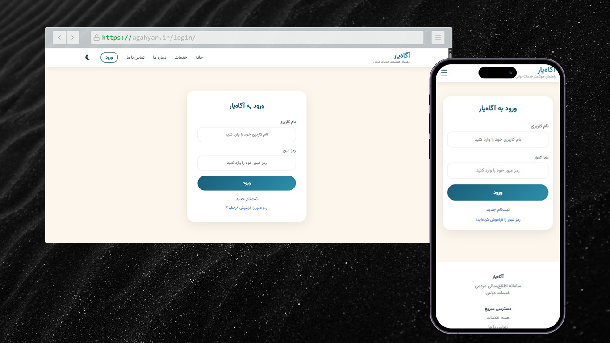
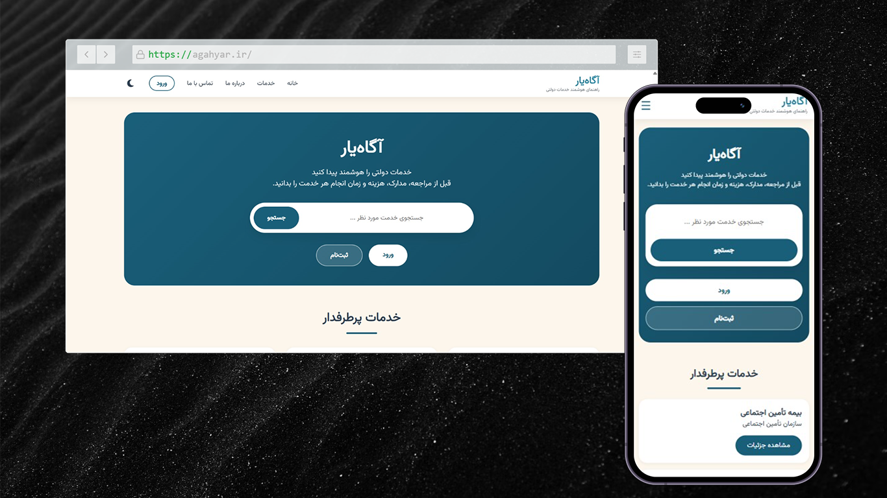
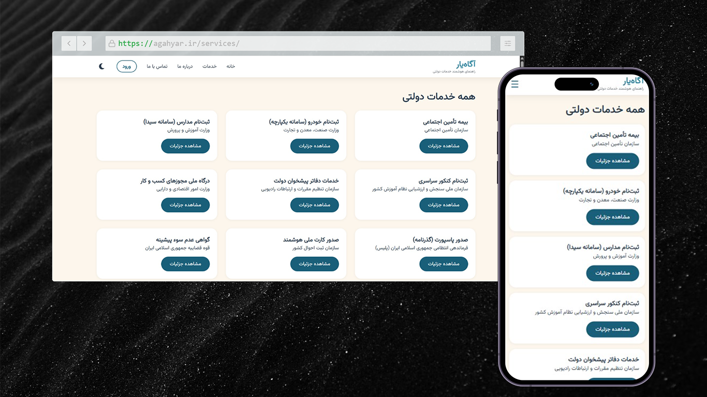
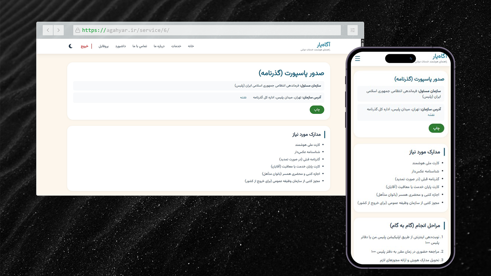
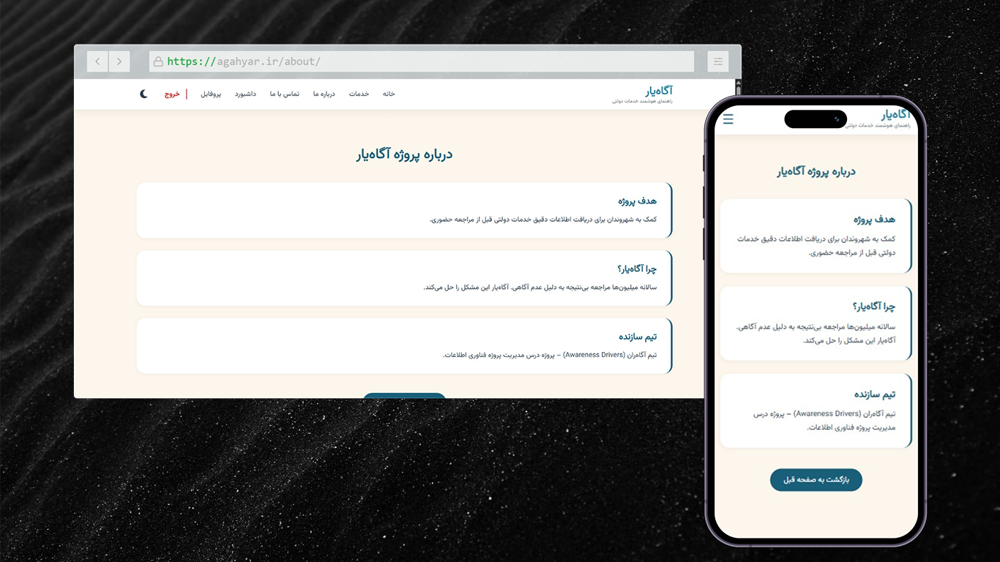
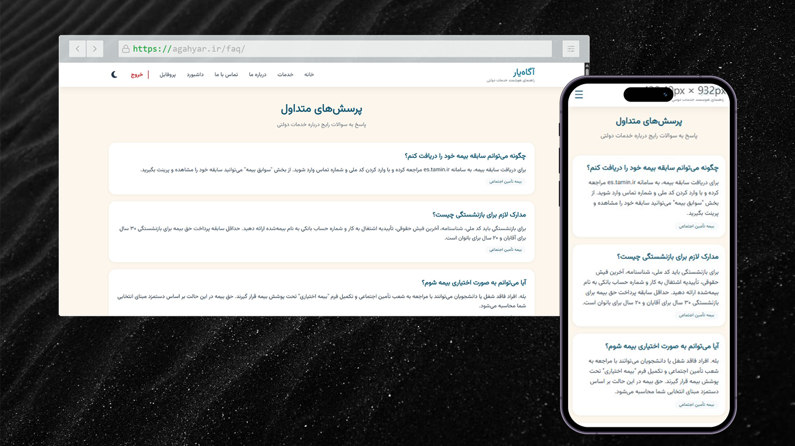
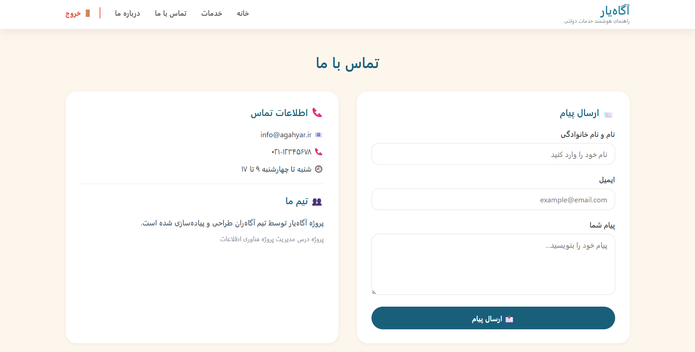
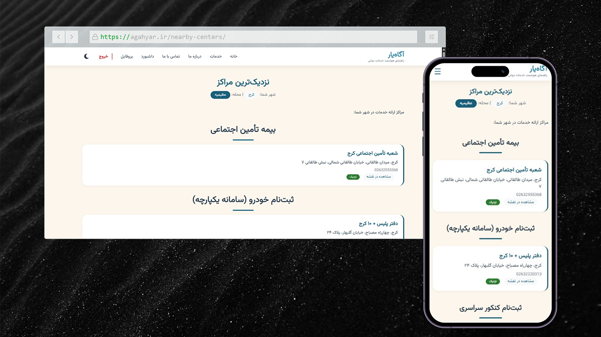

# 🏛️ Agahyar (آگاه‌یار)

**Smart Citizen Information System for Government Services.**

## 📖 About the Project

**Agahyar** helps citizens access accurate information about government
services before visiting offices in person — showing **required documents**,
**steps**, **costs**, **duration**, and **nearest service centers** in one
place.

> ❗ **Problem:** Millions of unsuccessful office visits happen every year due to
> lack of awareness.
>
> ✅ **Solution:** Agahyar empowers citizens with knowledge, saving time, money,
> and reducing frustration.

---

## ✨ Key Features

- 🔍 **Smart Search** – Find services by name, organization, or city, making it quick and easy to locate the exact government service you need.

- 📄 **Service Details** – View complete information for every service, including required documents, application steps, estimated cost, and processing duration before visiting an office.

- 📍 **Nearest Centers** – Discover the closest service center based on the user's city and neighborhood, with direct Google Maps links for easy navigation.

- 🔐 **User Authentication** – Secure sign up and login system with city and neighborhood preferences stored for a personalized experience.

- ⭐ **Rating & Feedback** – Share your experience by rating services from 1–5 stars and leaving public comments to help other citizens.

- 🔖 **Bookmark Services** – Save frequently used or important services to your personal favorites list for faster access later.

- 🖨️ **Print-Friendly View** – Generate a clean, printer-optimized version of service details that can be printed or saved as PDF.

- 🌙 **Dark/Light Theme** – Switch between dark and light themes with preferences automatically saved using localStorage.

- 🇮🇷 **Persian Error Messages** – Backend error codes are translated into clear and user-friendly Persian messages for a better user experience.

- 🛡️ **Security Hardening** – Includes rate limiting, Content Security Policy (CSP), configurable admin URL, and secure session settings to improve application security.

- 📱 **Fully Responsive** – Optimized for mobile phones, tablets, laptops, and desktop devices with a consistent user experience.

- ⚙️ **Admin Panel** – Manage services, FAQs, and service centers efficiently through the Django administration panel.

---

## 🎯 Why Agahyar?

Agahyar aims to reduce unnecessary government office visits by providing
accurate, centralized, and easy-to-understand information about public
services.

Instead of searching across multiple websites or asking others, citizens can
find everything they need in one place.

---

## 🛠️ Technologies Used

- 🐍 **Python 3.12 / Django 6.0** – Backend
- ⚡ **uv** – Python package manager
- 🗄️ **PostgreSQL / PostGIS** – Database
- 🚀 **Redis** – Cache & sessions (production)
- 🐳 **Docker** – Containerized development and deployment
- 🎨 **HTML5 / CSS3 / JavaScript (vanilla)** – Frontend; Font Awesome icons
- 🔧 **Gunicorn** – Production WSGI server

---

## 🖼️ Project Preview

### 🔐 Login



### 🏠 Home



### 📋 Services



### 📑 Service Details



### ℹ️ About



### ❓ FAQ



### 📞 Contact



### 📍 Nearest Centers



#### 📚 Resources used for the screenshots

- [Background Picture](https://unsplash.com/photos/grey-sand-wave-RCAhiGJsUUE)
- [Screenshot Extension](https://screenshot.rocks/)

---

## 🚀 How to Run the Project

## ⚡ Quick Start (Docker)

```bash
git clone https://github.com/Fatemehmohammadganji/agahyar-project.git
cd agahyar-project

cp .env.example .env
docker compose -f docker-compose.dev.yml up --build
```

Populate sample data (optional):

```bash
docker compose -f docker-compose.dev.yml exec web uv run scripts/populate_services.py
docker compose -f docker-compose.dev.yml exec web uv run scripts/populate_faq.py
```

Visit **<http://localhost:8000>** in your browser.

Run tests:

```bash
docker compose -f docker-compose.dev.yml exec web uv run pytest
```

For detailed development instructions, see [DEVELOPMENT.md](DEVELOPMENT.md).
For production deployment, see [DEPLOYMENT.md](DEPLOYMENT.md).

---

## 📂 Project Structure

```text
agahyar-project/
├── src/                    # Python packages
│   ├── agahyar_project/    # Django project config
│   └── services/           # Main app (models, views, forms, etc.)
├── templates/
│   └── services/           # HTML templates
├── static/services/        # CSS, JS, fonts, icons (no CDN)
├── scripts/                # Database population scripts
└── docker-compose*.yml     # Dev & production Docker configs
```

---

## 🚀 Roadmap

- [ ] 🤖 Real AI integration (OpenAI / Google Maps API) for dynamic center detection
- [ ] 📱 Mobile app (Android / iOS)
- [ ] 🌍 Multi-city support (all major Iranian cities)
- [ ] 🌐 Multi-language (English and other languages)
- [ ] 🔐 OAuth2 login and two-factor authentication
- [ ] 🔔 Notification system for service updates

---

## 🚀 Current Project Status

Agahyar is currently in an active development stage.

✅ Core features have been implemented, including:

- User authentication
- Smart service search
- Service details
- Service center locator
- Bookmarks
- Ratings and comments
- Admin management
- Responsive interface
- Dark/Light mode
- Security hardening

Future development will focus on AI-powered recommendations, multi-city support, mobile applications, multilingual support, and integration with external APIs.

---

## 🎯 Project Goals

The primary goal of **Agahyar** is to simplify access to government service information and reduce unnecessary in-person visits to public offices.

The project focuses on:

- Providing accurate and centralized information about government services
- Helping citizens prepare required documents before visiting service centers
- Saving citizens' time and reducing unnecessary travel costs
- Improving transparency of administrative procedures
- Offering a simple, accessible, and responsive user experience across devices
- Building a secure and scalable web application using modern development practices

---

## 🌟 Project Highlights

- 🏛️ Solves a real-world public service accessibility problem
- ⚡ Built with Django 6 following modern backend development practices
- 🔐 Security-focused architecture with rate limiting and CSP protection
- 📱 Fully responsive design for desktop, tablet, and mobile devices
- ⭐ User-centered features including bookmarks, ratings, and feedback
- 🌙 Persistent Dark/Light theme support
- 📍 Location-based service center discovery
- 🐳 Docker-ready for development and deployment
- 🧪 Structured project organization suitable for future scalability
- 📖 Comprehensive documentation and easy local setup

---

## 💡 Motivation

Government services are often scattered across multiple websites and organizations, making it difficult for citizens to find accurate and up-to-date information.

Agahyar was created to centralize this information into a single platform where users can quickly learn about required documents, procedures, costs, service centers, and other essential details before visiting government offices.

---

## 🤝🏻 Team

-  Fatemeh Mohammadganji – Project Manager & Frontend Developer
-  Zahra Kamalian – Backend Developer
-  Mohsen Ali Ahmadi – Database Developer & Organization Liaison

---

## 🎓 Academic Project

This project was developed as a **university team project** for the **Project Management and Control** course during the **1404–1405** academic year.

The project was designed to simulate a real software development lifecycle, including project planning, requirement analysis, system design, implementation, documentation, testing, and team collaboration.


